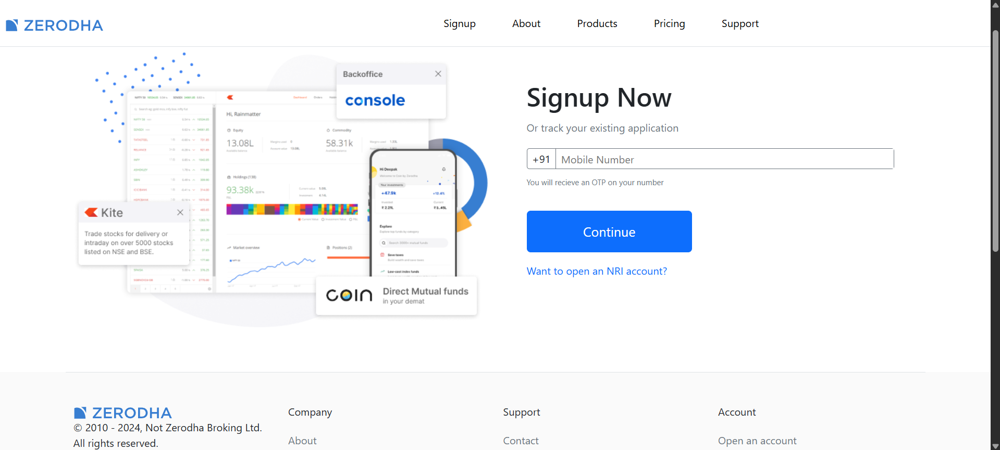
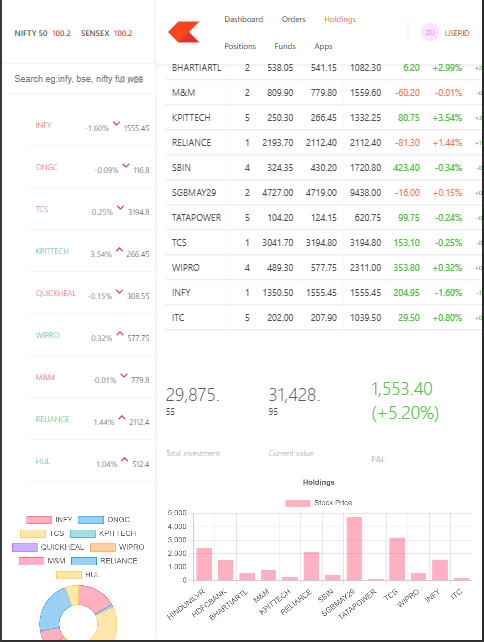

# 📊 Zerodha Clone

A full-stack clone of Zerodha built using React, Node.js, and MongoDB.

---

## 🔗 Live Demo

- 🌐 **Frontend**: [Visit Website](https://zerodha-clone-d1ib.onrender.com/)
- 📋 **Dashboard**: [Visit Dashboard](https://zerodha-dashboard-seaw.onrender.com/)

- 🚀 **Backend API**: [Visit API](https://zerodha-server-oihk.onrender.com/allHoldings)

---

## 🖼️ Screenshots

### 🏠 Frontend

### 📈 Dashboard (iPad Mini)

---

## 🚀 Tech Stack

- **Frontend**: React, Axios, React Router DOM, Bootstrap
- **Backend**: Node.js, Express, MongoDB
- **Deployment**: Render (Frontend & Backend)

---
